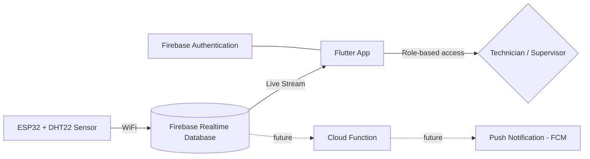
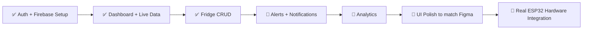

<div align="center">

# ❄️ MLCMS
### Malaria Cold Chain Monitoring System

**Real-time temperature & humidity monitoring for vaccine and reagent cold storage — built for lab technicians and supervisors who can't afford a broken cold chain.**


</div>

---

## 📖 Table of Contents

- [About the Project](#-about-the-project)
- [Features](#-features)
- [Tech Stack](#-tech-stack)
- [System Architecture](#-system-architecture)
- [Screens](#-screens)
- [Getting Started](#-getting-started)
- [Project Structure](#-project-structure)
- [Roadmap](#-roadmap)
- [Team](#-team)

---

## 🧊 About the Project

Vaccines, reagents, and blood products stay safe only within a narrow temperature window. One unnoticed door left ajar, one faulty compressor, and hours of silent spoilage can wipe out an entire batch — often without anyone knowing until it's too late.

**MLCMS** replaces manual temperature logbooks with **live, automated cold-chain monitoring**. A low-cost ESP32 sensor reports live temperature and humidity straight to the cloud, and the mobile app gives lab staff an at-a-glance view of every monitored unit — with instant alerts the moment something drifts out of range.

Built for **Android & iOS** using Flutter, with Firebase handling authentication, live data sync, and role-based access for technicians and supervisors.

---

## ✨ Features

<details open>
<summary><strong>✅ Built & working</strong></summary>

- [x] Email/password authentication with role-based accounts (Technician / Supervisor)
- [x] Live dashboard streaming real-time fridge data from Firebase
- [x] Fridge detail view — live temperature, humidity, door status, connection status
- [x] Add / Edit / Delete fridges (full CRUD)
- [x] Safe-range validation with in-range / breaching status indicators
- [x] Secured Realtime Database rules (authenticated access only)

</details>

<details>
<summary><strong>🚧 Planned / in progress</strong></summary>

- [ ] Push notifications on temperature/humidity breach (Firebase Cloud Messaging)
- [ ] Alerts & Incidents screen with breach history
- [ ] Analytics dashboard — uptime %, time-in-range charts, trends
- [ ] Settings screen (°C/°F toggle, dark mode)
- [ ] Account settings (edit profile)
- [ ] Navigation drawer
- [ ] Real ESP32 + DHT22 hardware pushing live sensor data
- [ ] Door-open detection via reed switch sensor
- [ ] Manual cooling override *(stretch goal — requires relay hardware)*

</details>

---

## 🛠 Tech Stack

| Layer | Technology |
|---|---|
| **Mobile App** | Flutter (Android & iOS) |
| **Authentication** | Firebase Authentication (Email/Password) |
| **Database** | Firebase Realtime Database |
| **Hardware** | ESP32 + DHT22 Temperature/Humidity Sensor |
| **Connectivity** | WiFi (ESP32 → Firebase, no direct Bluetooth pairing) |
| **Design** | Figma (interactive prototype + wireframes) |

---

## 🏗 System Architecture



Each fridge is registered as its own entity in the database (`/fridges/{id}`), with its live sensor reading stored as a field — not a separate "sensor" object — keeping the data model simple while still supporting multiple monitored units.

---

## 📱 Screens

| Screen | Status |
|---|---|
| Login / Sign Up | ✅ Built |
| Dashboard (live fridge list) | ✅ Built |
| Fridge Detail | ✅ Built |
| Add / Edit Fridge | ✅ Built |
| Manage Fridges | ✅ Built |
| Alerts & Incidents | 🚧 Planned |
| Analytics | 🚧 Planned |
| Settings & Account | 🚧 Planned |

> Full UI/UX wireframes and an interactive Figma prototype are available separately — see the project submission folder.

---

## 🚀 Getting Started

### Prerequisites
- [Flutter SDK](https://docs.flutter.dev/get-started/install) installed
- A Firebase project with **Authentication** (Email/Password) and **Realtime Database** enabled
- [FlutterFire CLI](https://firebase.google.com/docs/flutter/setup) installed

### Setup

```bash
# 1. Clone the repo
git clone https://github.com/<your-org>/mlcms_app.git
cd mlcms_app

# 2. Install dependencies
flutter pub get

# 3. Connect your Firebase project
flutterfire configure

# 4. Run the app
flutter run
```

### Firebase Realtime Database structure

```json
{
  "fridges": {
    "fridge1": {
      "name": "BCG Vaccine Fridge",
      "location": "Lab Room 1 - North Wall",
      "model": "ESP32-DHT22",
      "minTemp": 2.0,
      "maxTemp": 8.0,
      "temperature": 4.4,
      "humidity": 46,
      "doorOpen": false,
      "lastSeen": 1759430400000
    }
  },
  "users": {
    "<uid>": {
      "email": "tech1@mlcms.com",
      "role": "technician"
    }
  }
}
```

### Security Rules (minimum)

```json
{
  "rules": {
    "fridges": {
      ".read": "auth != null",
      ".write": "auth != null"
    },
    "users": {
      ".read": "auth != null",
      ".write": "auth != null"
    }
  }
}
```

---

## 📂 Project Structure

```
lib/
├── main.dart                   # App entry point, Firebase init, auth routing
├── firebase_options.dart       # Auto-generated by FlutterFire CLI
├── models/
│   └── fridge.dart             # Fridge data model
├── services/
│   ├── auth_service.dart       # Login, signup, role lookup
│   └── fridge_service.dart     # Live streams, CRUD for fridges
└── screens/
    ├── login_screen.dart
    ├── signup_screen.dart
    ├── dashboard_screen.dart
    ├── fridge_detail_screen.dart
    ├── add_fridge_screen.dart
    ├── edit_fridge_screen.dart
    └── manage_fridges_screen.dart
```

---

## 🗺 Roadmap



---

## 👥 Team

| Name | Role |
|---|---|
| Takudzwa Kachingwe | Mobile App Development (Flutter, Firebase) |
| Matthew Sithole | (Hardware / ESP32) |
| Lionah Basket | (UI/UX Design) |
| Tanatswa Mapuke | (Backend / Cloud Functions) |

---

<div align="center">

*Built for a cold chain that doesn't break when no one's watching.*

</div>
